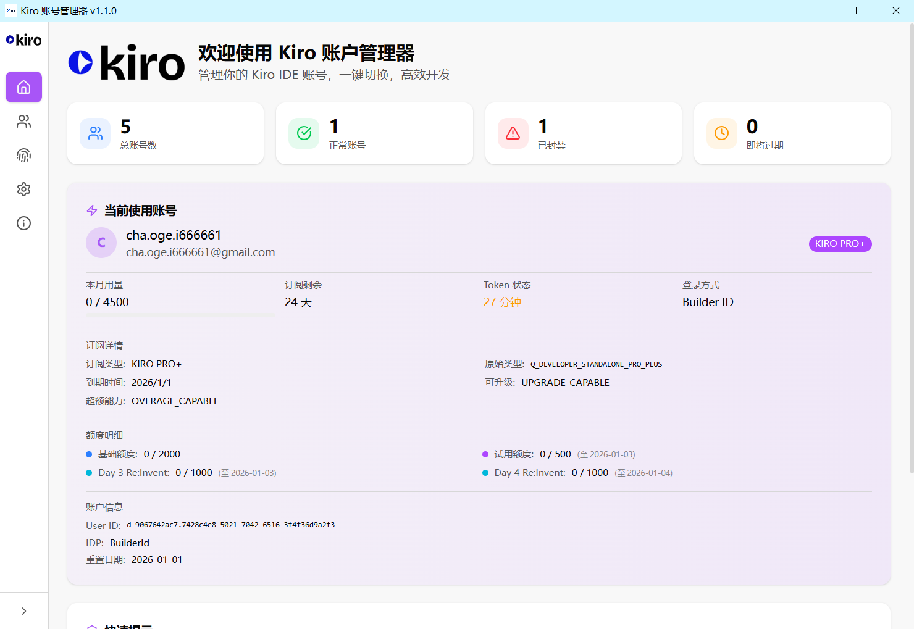
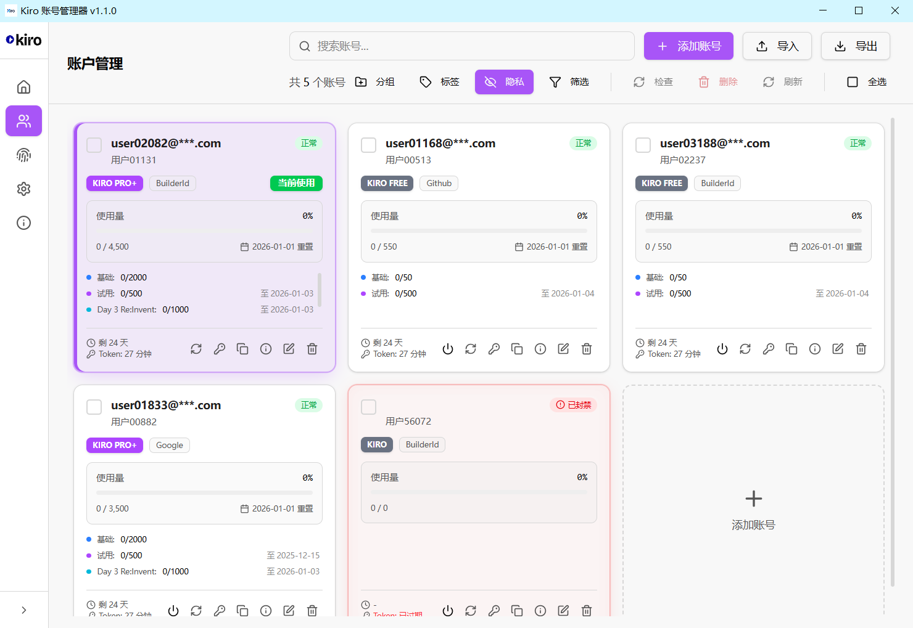
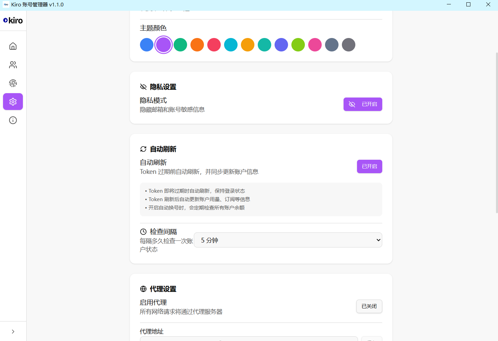
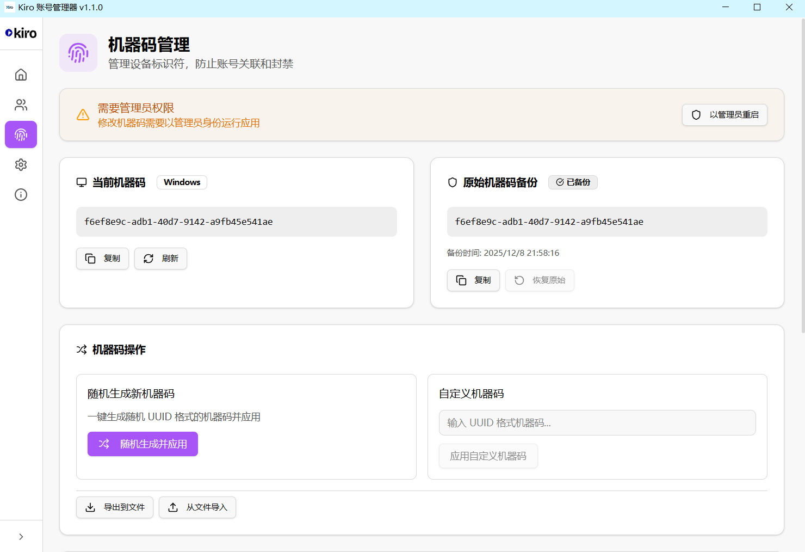

<p align="center">
  
</p>

<h1 align="center">Kiro Account Manager</h1>

<p align="center">
  Desktop app to <strong>automatically register Kiro accounts</strong>, manage subscriptions, monitor usage, and switch accounts in one click.
</p>

<p align="center">
  
  
  
  
</p>

---

## Screenshots

<p align="center">
  
  <br/><em>Home — active account, usage quota, subscription info</em>
</p>

<p align="center">
  
  <br/><em>Account Manager — multi-account grid with status badges</em>
</p>

<p align="center">
  
  &nbsp;&nbsp;
  
  <br/><em>Settings &amp; Machine ID management</em>
</p>

---

## Highlights

### 🤖 Fully Automated Kiro Account Registration

The core feature. Paste a list of Outlook accounts and the app handles everything end-to-end:

1. Opens a browser and navigates to the AWS Builder ID signup page
2. Fills in email, display name, and password automatically
3. **Retrieves the OTP verification code** — in three ways, each as a fallback to the next:
   - **Full-auto** (recommended): calls Microsoft Graph API to read the OTP from the mailbox directly — no browser interaction needed
   - **Outlook scrape**: if no Graph credentials, keeps the Outlook tab open, clicks the latest AWS email, and reads the code from the rendered body
   - **Manual fallback**: if neither is possible, waits for you to paste the OTP into the visible browser — then continues automatically
4. Completes registration and extracts the SSO token
5. Imports the account into the manager — ready to use in Kiro IDE

### 📊 Usage Monitoring

Real-time usage tracking per account — quota consumed, days until reset, token expiry countdown.

### 🔄 One-click Account Switch

Switch the active Kiro account instantly without touching the IDE.

### 🪪 Machine ID Management

View and rotate the Machine ID directly from the UI.

### ⚙️ Kiro Settings

Edit steering instructions and MCP server config without leaving the app.

### 🌐 Multi-language

English / Vietnamese (i18n via i18next).

---

## Auto Register — Input Format

Paste one account per line into the Auto Register tab:

```
email|password|refresh_token|client_id
```

| Fields | Description |
|---|---|
| `email` | Outlook email address |
| `password` | Outlook account password |
| `refresh_token` | Microsoft OAuth2 refresh token (e.g. `M.C509_xxx...`) |
| `client_id` | Microsoft Graph API client ID (e.g. `9e5f94bc-xxx...`) |

**`refresh_token` + `client_id` are optional.** The app degrades gracefully:

| Provided | Behavior |
|---|---|
| `email` + `password` + `refresh_token` + `client_id` | ✅ Full-auto — reads OTP via Graph API |
| `email` + `password` only | ✅ Semi-auto — opens Outlook tab, clicks latest AWS email |
| `email` only | ⚠️ Manual — browser stays open, waiting for you to paste OTP |

### Example

```
alice@outlook.com|MyPass123!|M.C509_BAvXxxxxxxxx|9e5f94bc-xxxx-xxxx-xxxx-xxxxxxxxxxxx
bob@outlook.com|AnotherPass!
```

---

## Tech Stack

| | |
|---|---|
| Framework | Electron 38 + React 19 + TypeScript |
| Build | electron-vite + Vite 6 |
| Styling | Tailwind CSS v4 |
| Browser automation | Playwright (Chromium) |
| State | Zustand |
| Storage | electron-store |
| i18n | i18next + react-i18next |

---

## Getting Started

```bash
# Install dependencies
npm install

# Install Playwright browser (first time only)
npm run install-browser

# Run in dev mode
npm run dev
```

## Build

```bash
npm run build:win    # Windows (.exe)
npm run build:mac    # macOS (.dmg)
npm run build:linux  # Linux (.AppImage)
```

---

## License

MIT
